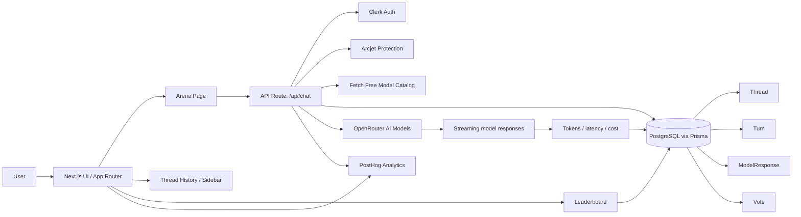

# LLM Arena Architecture

This diagram shows the overall architecture of the project:

- browser UI
- server-side chat handling
- Prisma/PostgreSQL persistence
- external AI and analytics services
- voting and leaderboard flow
