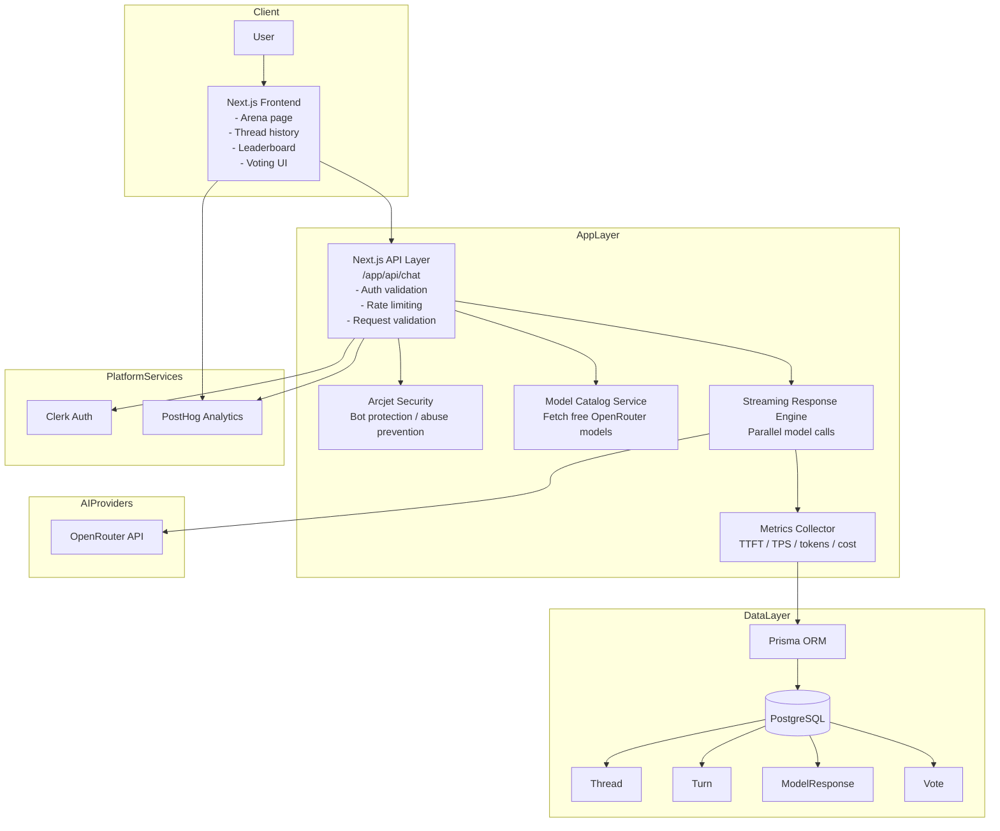

# LLM Arena System Design

## Flow

1. User submits a prompt from the UI.
2. API validates the authenticated user and checks for abuse.
3. The app fetches the active free model catalog.
4. The backend starts parallel streaming requests to multiple models.
5. Each response is measured for latency, token throughput, and cost.
6. Results are stored in PostgreSQL via Prisma.
7. The user votes on the best answer, and the leaderboard updates from persisted data.
8. PostHog collects analytics for product and monitoring insights.

## Design Highlights

- Real-time multi-model comparison
- Scalable stateless API layer with persistent relational storage
- Clean separation between frontend, backend, AI providers, and data persistence
- Security and observability built into the request pipeline
